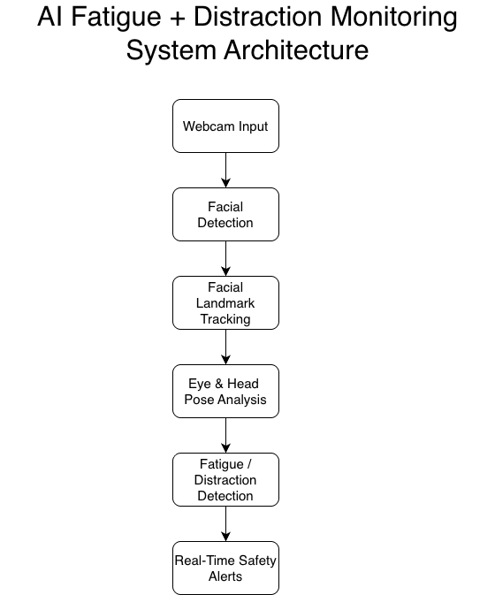
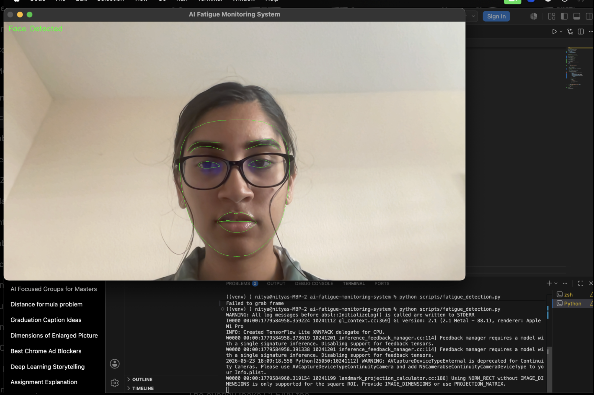
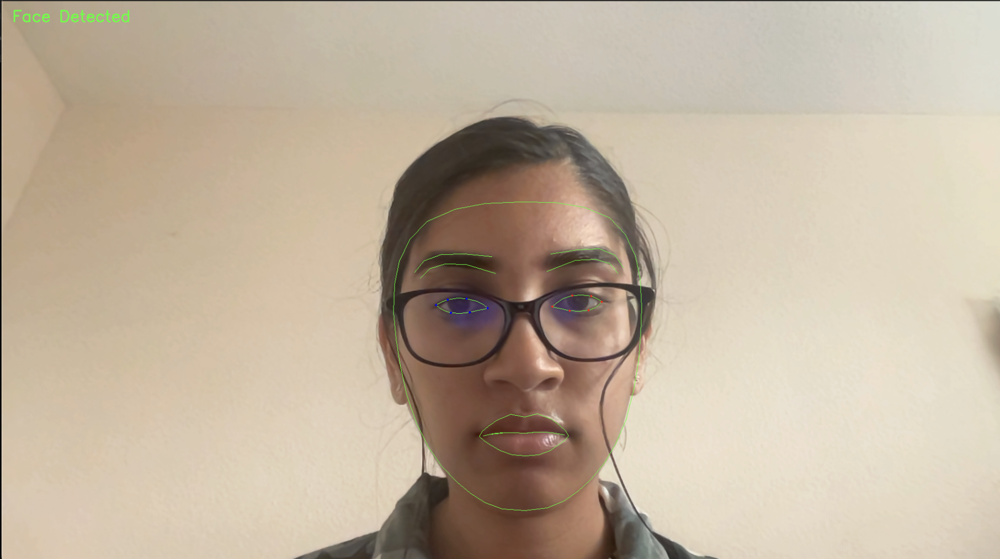
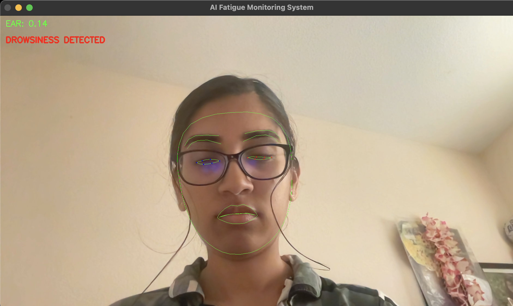
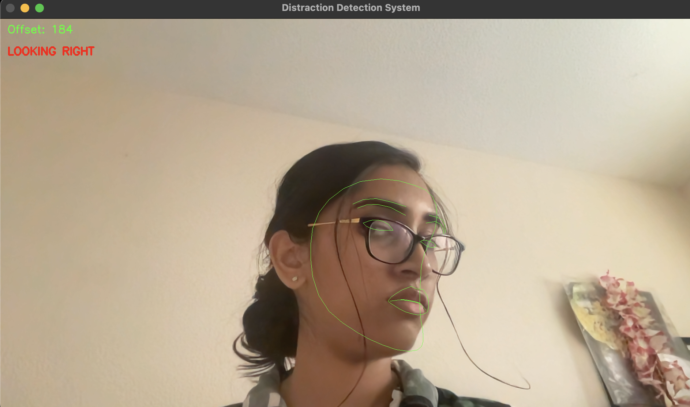

# AI Fatigue + Distraction Monitoring System

## Overview

The AI Fatigue + Distraction Monitoring System is a real-time computer vision platform designed to monitor driver attentiveness and detect potentially unsafe behavior through live facial perception and behavioral analysis.

The system performs real-time webcam inference using MediaPipe Face Mesh, OpenCV, and geometric facial landmark analysis to identify signs of drowsiness and distraction. By combining Eye Aspect Ratio (EAR) fatigue estimation with head pose–based distraction monitoring, the platform generates live safety alerts capable of identifying prolonged eye closure and directional attention drift.

This project demonstrates the integration of real-time perception pipelines, human-centered AI monitoring, and intelligent safety analysis within a unified computer vision system.

---

# Features

- Real-time webcam inference pipeline
- Facial landmark extraction using MediaPipe Face Mesh
- Eye landmark tracking and geometric analysis
- Eye Aspect Ratio (EAR)-based fatigue detection
- Head pose estimation for distraction monitoring
- Real-time driver attention analysis
- Unified multimodal safety monitoring system
- Live visual alert generation
- Real-time facial mesh visualization
- Modular computer vision architecture

---

# System Architecture



---

# Demo Results

## Facial Landmark Tracking



---

## Eye Landmark Tracking



---

## Drowsiness Detection



---

## Distraction Detection



---

# System Pipeline

```text
Webcam Input
    ↓
Face Detection
    ↓
MediaPipe Facial Landmark Tracking
    ↓
Eye Landmark Extraction + Head Pose Analysis
    ↓
EAR Fatigue Analysis + Distraction Monitoring
    ↓
Real-Time Safety Alert Generation